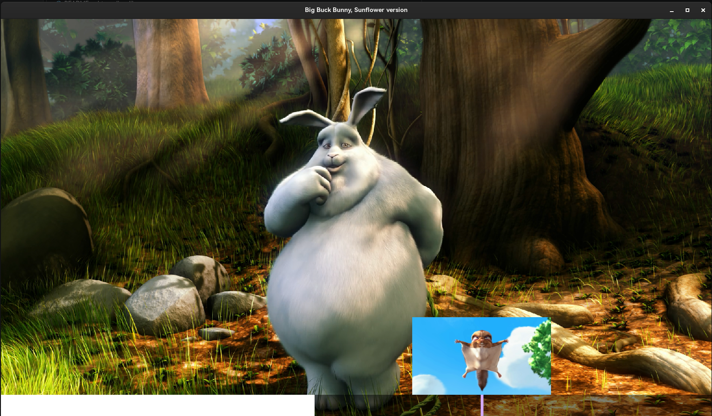

# raylibmpv



### 简介
使用raylib和libmpv实现的视频播放器\
学习性项目

### 实现思路
raylib管理窗口和用户输入\
使用libmpv将视频画面渲染在raylib的opengl纹理上\
使用ffmpeg获取视频缩略图\

### dependencies
1. spdlog
2. ffmpeg
3. x11(Linux)
4. winmm(windows)
5. opengl32(windows)
6. gdi32(windows)
7. raylib(仓库有)
8. libmpv(仓库有)

### compile
``` meson
meson setup build
meson compile -c build
```

### usage
`cvp $videoPath`
